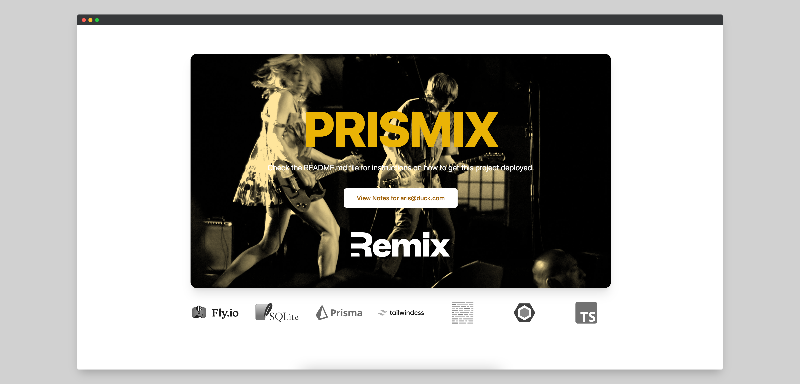

# Remix Prisma Tailwind Stack



Learn more about [Remix Stacks](https://remix.run/stacks).

```
yarn create remix --template riipandi/prismix <my_app>
```

## What's in the stack

- [Fly app deployment](https://fly.io) with [Docker](https://www.docker.com/)
- Production-ready [SQLite Database](https://sqlite.org)
- Healthcheck endpoint for [Fly backups region fallbacks](https://fly.io/docs/reference/configuration/#services-http_checks)
- [GitHub Actions](https://github.com/features/actions) for deploy on merge to production and staging environments
- Email/Password Authentication with [cookie-based sessions](https://remix.run/docs/en/v1/api/remix#createcookiesessionstorage)
- Database ORM with [Prisma](https://prisma.io)
- Styling with [Tailwind](https://tailwindcss.com/)
- Code formatting with [Prettier](https://prettier.io)
- Linting with [ESLint](https://eslint.org)
- Static Types with [TypeScript](https://typescriptlang.org)

## Quickstart

### Up and running

- Initial setup: _If you just generated this project, this step has been done for you._

  ```sh
  cp .env.example .env
  yarn db:init
  yarn db:setup
  ```

- Start dev server:

  ```sh
  yarn dev
  ```

This starts your app in development mode, rebuilding assets on file changes.

The database seed script creates a new user with some data you can use to get started:

- Email: `aris@duck.com`
- Password: `passw0rd`

### Relevant code:

This is a pretty simple note-taking app, but it's a good example of how you can build a full stack app with Prisma and Remix.
The main functionality is creating users, logging in and out, and creating and deleting notes.

- creating users, and logging in and out [./app/models/user.server.ts](./app/models/user.server.ts)
- user sessions, and verifying them [./app/session.server.ts](./app/session.server.ts)
- creating, and deleting notes [./app/models/note.server.ts](./app/models/note.server.ts)

## Deployment

This Remix Stack comes with two GitHub Actions that handle automatically deploying your app to production and staging environments.

Prior to your first deployment, you'll need to do a few things:

- [Install Fly](https://fly.io/docs/getting-started/installing-flyctl/)

- Sign up and log in to Fly

  ```sh
  fly auth signup
  ```

  > **Note:** If you have more than one Fly account, ensure that you are signed into the same account in the Fly CLI as you are in the browser. In your terminal, run `fly auth whoami` and ensure the email matches the Fly account signed into the browser.

- Create two apps on Fly, one for staging and one for production:

  ```sh
  fly apps create prismix
  fly apps create prismix-staging
  ```

  > **Note:** Make sure this name matches the `app` set in your `fly.toml` file. Otherwise, you will not be able to deploy.

- Create a new [GitHub Repository](https://repo.new), and then add it as the remote for your project. **Do not push your app yet!**

  ```sh
  git remote add origin <ORIGIN_URL>
  ```

- Add a `FLY_API_TOKEN` to your GitHub repo. To do this, go to your user settings on Fly and create a new [token](https://web.fly.io/user/personal_access_tokens/new), then add it to [your repo secrets](https://docs.github.com/en/actions/security-guides/encrypted-secrets) with the name `FLY_API_TOKEN`.

- Add a `SESSION_SECRET` to your fly app secrets, to do this you can run the following commands:

  ```sh
  fly secrets set SESSION_SECRET=$(openssl rand -hex 32) --app prismix
  fly secrets set SESSION_SECRET=$(openssl rand -hex 32) --app prismix-staging
  ```

  If you don't have openssl installed, you can also use [1password](https://1password.com/password-generator/) to generate a random secret, just replace `$(openssl rand -hex 32)` with the generated secret.

- Create a persistent volume for the sqlite database for both your staging and production environments. Run the following:

  ```sh
  fly volumes create data --size 1 --app prismix
  fly volumes create data --size 1 --app prismix-staging
  ```

- Deploy the application by run the following:

  ```sh
  fly deploy
  ```

  The application will available at `https://prismix.fly.dev`.

### Connecting to your database

The sqlite database lives at `/data/sqlite.db` in your deployed application. You can connect to the live database by running `fly ssh console -C database-cli`.

### Getting Help with Deployment

If you run into any issues deploying to Fly, make sure you've followed all of the steps above and if you have, then post as many details about your deployment (including your app name) to [the Fly support community](https://community.fly.io). They're normally pretty responsive over there and hopefully can help resolve any of your deployment issues and questions.

## Development

This project uses TypeScript for type checking, [ESLint](https://eslint.org/) for linting which
is configured in `.eslintrc.js`, and [Prettier](https://prettier.io/) for auto-formatting in
this project. It's recommended to get TypeScript set up for your editor and install an editor
plugin (like the [VSCode Prettier plugin](https://s.id/vscode-prettier)) to get auto-formatting
on saving and get a really great in-editor experience with type checking and auto-complete.
